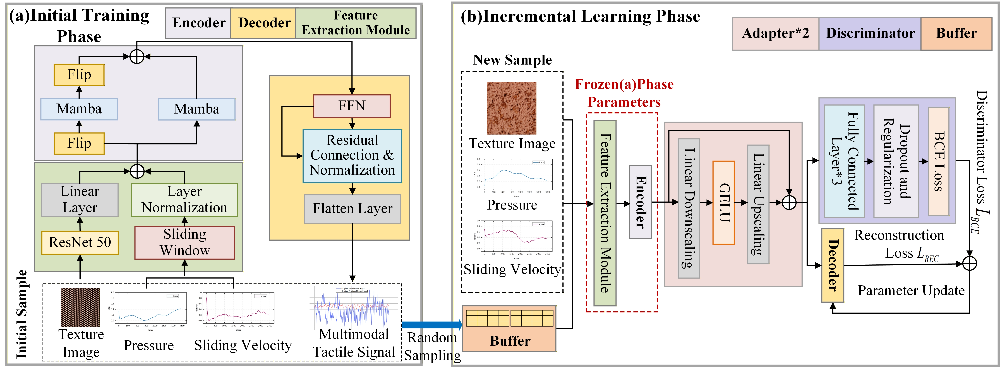

# Multidimensional Texture Haptic Display based on Generative Replay Incremental Learning Model

<h3 align="center">ABSTRACT</h3>

With the continuous expansion of texture sample data, the texture haptic model needs to maintain stable rendering of learned textures while continuously acquiring new texture features. However, existing models often fail to effectively absorb new knowledge in continuous learning scenarios, or cannot simul- taneously balance the learning efficiency of new textures and the maintenance of existing representation capabilities. To address this issue, we propose a texture haptic continuous learning model (THCLM) based on generative replay mechanism. This model adds a continuous learning phase to our previous initial training phase work. The continuous learning phase introduces a buffer and an adapter for replay learning, and freezes the backbone net- work parameters to avoid the destruction of existing knowledge by new tasks. Through joint loss optimization of the decoder and discriminator, THCLM enhances its fitting ability to new tasks. We trained the model on the SENS3 dataset and conducted four systematic validation experiments. The results showed that THCLM can effectively learn new knowledge, exhibiting superior performance in combating catastrophic forgetting (with a BWT value of -0.101). Compared to existing advanced haptic signal generation methods, its generalization performance is better. Finally, we conducted two user experiments, and the results show that THCLM can effectively absorb new sample information, enabling users to acquire higher accuracy (89%) in virtual and real texture matching tasks. Compared with existing baseline methods, our method achieves the current highest perceptual average similarity score (7.6), verifying its effectiveness in con- tinuous learning ability within dynamic texture scenarios.

<h3 align="center">Texture Tactile Continuous Learning Model</h3>

In our earlier work【Chen D, Ding Y, Gao P, et al. Multi-dimensional Texture Haptic Cross-modal Generation and Display Method based on Bi-Mamba Network[J]. IEEE Transactions on Instrumentation and Measurement, 2025.】, we constructed a multidimensional texture haptic rendering model based on multimodal data (texture images and user interaction information) to generate acceleration and friction signals in real-time for user interac- tions with virtual textures. Building upon this foundation, this study introduces structural improvements and incorporates a continuous learning strategy based on a replay mechanism, with the overall architecture depicted in the following figure.

<p align="center">
  
</p>

### Dataset
The SENS3 dataset 【Balasubramanian J K, Kodak B L, Vardar Y. Sens3: Multisensory database of finger-surface interactions and corresponding sensations[C]//International Conference on Human Haptic Sensing and Touch Enabled Computer Applications. Cham: Springer Nature Switzerland, 2024: 262-277.】is a multi-modal texture-tactile perception resource library specifically designed for object surface interaction scenarios. Its core design revolves around the physical logic of authentic tactile interactions. By synchronously capturing visual texture features (texture RGB images),dynamic interaction parameters (such as pressure, sliding velocity, contact angle, and other time-series data), and haptic feedback signals (acceleration, friction force, vibration frequency, etc.) through dedicated acquisition devices,this dataset provides high-quality data support aligned with real-world interaction scenarios for research into haptic signal reconstruction, continuous learning, and related algorithms. It encompasses ten categories of texture samples,including everyday fabrics, metals, and woods. Each category contains repeated data collected from multiple users across diverse interaction scenarios. For more details, see https://link.springer.com/chapter/10.1007/978-3-031-70058-3_21

### Data Preparation
Start by running `utils/data_deal.py` to retrieve and organize the required original dataset.
```bash
utils/data_deal.py
```

Then run 'utilities/dataprocess. py', align the Excel data by file name, and merge it into a CSV file. Crop the data before and after and save it as standardized results to obtain the initial training data and incremental learning data, which are two folders.
```bash
utils/dataprocess.py
```

### (a) Initial training phase
During the initial training phase, the system receives multimodal input data from initial samples, including texture images, pressure force, and sliding velocity. Texture images extract high-level visual features through the ResNet50 network, with their dimensions adjusted via linear layer mapping to align with temporal modalities. Interactive action signals (pressure and sliding velocity) undergo sliding window segmentation and layer normalization to ensure comparability and stability of temporal inputs. Subsequently, the multimodal features are fused in parallel and fed into the Bi-Mamba encoder for deep feature extraction. Finally, the decoder maps these deep features back to the temporal space, generating acceleration and friction signals. This completes training of the initial haptic rendering network, thereby constructing the initial pre-trained model.

Adjust 'args. is_training==1' in 'configs/configs. py' and train the model using 'main. py'. Adjust parameters such as epoch and batch_2 according to the training environment, and finally obtain the trained PTH file as the basic training result for the model.
```bash
main.py
```

### (b) Incremental learning stage
To address the continuous introduction of new texture samples and dynamic changes in interaction scenarios during practical applications, we further established an incremental learning phase. During this phase, the model undergoes synchronous training through the joint input of replay samples from the cache and newly added texture samples. To optimize the incremental learning process, we introduced an adapter and a discriminator module. The adapter enhances the model's adaptive capacity to new data distributions, enabling it to learn novel texture features while maintaining stable perception of previously learned textures. By updating the adapter's lightweight parameters, we effectively prevent disruption to the knowledge representations acquired in the backbone network, thereby significantly mitigating catastrophic forgetting. Concurrently, the discriminator evaluates and constrains the authenticity of outputs during tactile signal generation, further enhancing the precision and physical consistency of tactile signals. 
Next, run 'incremental-learning. py' to update and adjust the parameters of the initially trained PTH file, resulting in a new PTH model after incremental learning.

```bash
incremental_learning.py
```

